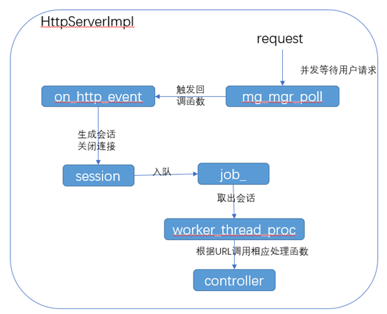

HTTP 服务器通过 HttpServerImpl 类和 controller 类实现的。HttpServerImpl 类用于实现 HTTP 通信，controller 类用于建立 URL 和处理函数的对应关系。HTTP 服务器流程图如下：

- 在 HttpServerImpl 类中，mgr\_为 mg_mgr 结构体类型变量，首先通过 mg_mgr_init 初始化 mgr\_，然后通过 mg_bind 给 mgr\_绑定 IP 地址和回调函数 on_http_event。最后开启一个线程用于运行 mg_mgr_poll 函数，mg_mgr_poll 函数用于持续监听用户请求。
- 回调函数 on_http_event 用于处理接收连接和请求，然后处理请求和提取 HTTP 请求中的正文。每次获取到一个 HTTP 正文，回调函数 on_http_event 都会创建一个新的会话，然后对请求进行解析，将请求中的请求方法、url、body 等东西提取出来，放进会话的 request 结构体中。最后将会话放进会话队列 jobs\_中。最后 on_http_event 关闭连接。
- 在 HttpServerImpl 类中开启了 num_threads 个线程用于处理保存在会话队列 jobs\_的 HTTP 正文。这个线程的处理函数都是 worker_thread_proc，worker_thread_proc 不断监听会话队列 jobs\_，一旦监听到 jobs\_存在会话时，会取出会话中的 url，并调用此 url 对应的处理函数。
- worker_thread_proc 中会查找 url 对应的请求方式和处理函数。连接和处理函数的对应关系放在 map 类型的数组 router_map\_中。当连接在 router_map\_中没有对应的处理函数，那么就会查找此连接是否是对应某些静态文件。如果也没有找到静态文件，就返回 404 错误。
- router_map\_数组中存储的处理函数的具体实现是在 controller 类中进行的，即 controller 类用于构建 URL 和处理函数的对应关系，处理函数是通过 controller 类中的成员函数实现的

从 main.cpp 中可看出：
类 HttpServerImpl 用于实现服务器监听和处理 http 请求
类 Controller 用于添加 url 和 url 对应的处理函数

发送的请求的 body 中，只是 json 格式的数据，这个 body 会被解析出来。
